# UML Diyagramları

Aşağıdaki diyagramlar projenin çalışma prensibini ve nesneye dayalı mimarisini (OOP) açıklamaktadır. Diyagramlar Mermaid formatında oluşturulmuştur.

**Mimari Kararlar (Neden OOP?):** Proje Nesne Yönelimli Programlama (OOP) prensiplerine uygun olarak modellenmiştir. Bu sayede kodun okunabilirliği artırılmış, tekrar eden kodların önüne geçilmiş ve ileride projeye yeni özellikler eklemek çok daha kolay hale getirilmiştir.

## 1. Class Diagram (Sınıf Diyagramı)

Bu diyagram sistemdeki sınıfları, özelliklerini (encapsulation) ve aralarındaki kalıtım (inheritance) ilişkilerini göstermektedir.

**Önemli Mimari Prensipler:**
*   **Kapsülleme (Encapsulation):** Özelliklerin başına `-` (private) konulmuştur. Verilerin dışarıdan doğrudan ve kontrolsüzce değiştirilmesini engellemek için `get_` ve `set_` gibi metotlar tanımlanmıştır.
*   **Kalıtım (Inheritance) & Polimorfizm:** Bilet fiyatlarının hesaplanması bilet türüne göre değiştiği için `Ticket` adında soyut (abstract) bir üst sınıf oluşturulmuştur. `StandardTicket`, `StudentTicket` ve `ChildTicket` sınıfları buradan miras alır. Böylece ileride "VIP Bilet" eklemek istendiğinde sadece yeni bir sınıf oluşturmak yeterli olacak, var olan kod bozulmamış olacaktır (Açık-Kapalı / Open-Closed prensibi).
*   **İlişkiler:** `Cinema` sistemi `User` ve `Movie` sınıflarını doğrudan barındırır (Composition). `Movie` ise satılan `Ticket` objeleri ile bağlantılıdır (Aggregation).

```mermaid
classDiagram
    class User {
        -_username: string
        -_password: string
        +get_username(): string
        +check_password(password: string): bool
    }

    class Movie {
        -_name: string
        -_total_seats: int
        -_available_seats: int
        -_description: string
        -_trailer_url: string
        -_reservations: dict
        +get_name(): string
        +get_available_seats(): int
        +book_seat(seat_number, ticket: Ticket): bool
        +cancel_seat(seat_number, username): bool
    }

    class Ticket {
        <<abstract>>
        -_seat_number: int
        -_user_name: string
        +get_price()*: float
        +get_type(): string
        +get_seat(): int
        +get_user(): string
    }

    class StandardTicket {
        +get_price(): float
        +get_type(): string
    }

    class StudentTicket {
        +get_price(): float
        +get_type(): string
    }

    class ChildTicket {
        +get_price(): float
        +get_type(): string
    }

    class Cinema {
        -_movies: dict
        -_users: dict
        +register_user()
        +login_user()
        +add_movie()
        +book_ticket()
        +cancel_reservation()
    }

    Ticket <|-- StandardTicket : Kalıtım (Inheritance)
    Ticket <|-- StudentTicket : Kalıtım (Inheritance)
    Ticket <|-- ChildTicket : Kalıtım (Inheritance)

    Cinema *-- User : İçerir (Composition)
    Cinema *-- Movie : İçerir (Composition)
    Movie o-- Ticket : Rezerve Eder (Aggregation)
```



## 2. Use Case Diyagramı (Kullanım Durumu)

Sistemi kullanan aktörlerin gerçekleştirebileceği eylemleri gösterir.

**Aktörler ve Sistem Etkileşimleri:**
*   **Aktörlerin Ayrımı:** Sistemde "Ziyaretçi" ve "Kayıtlı Kullanıcı" olmak üzere iki farklı aktör belirlenmiştir. Ziyaretçiler sadece filmleri inceleyebilirken, kritik işlemler (bilet alma, iptal etme vb.) sadece kullanıcılara özeldir.
*   **Include (Dahil Etme) İlişkisi:** `<<include>>` ilişkisi ile bir eylemin zorunlu kıldığı diğer eylem modellenmiştir. Örneğin; bir kullanıcının "Bilet Rezerve Et" eylemini gerçekleştirebilmesi için arka planda mutlak suretle "Giriş Yap"mış olması gerektiği sisteme bu şekilde tanımlanmıştır.

```mermaid
usecaseDiagram
actor Kullanici as "Kayıtlı Kullanıcı"
actor Ziyaretci as "Ziyaretçi"

rectangle "Sinema Rezervasyon Sistemi" {
  Ziyaretci --> (Kayıt Ol)
  Ziyaretci --> (Giriş Yap)
  Ziyaretci --> (Filmleri ve Fragmanları Görüntüle)

  (Kayıt Ol) .> (Giriş Yap) : include
  
  Kullanici --> (Filmleri ve Fragmanları Görüntüle)
  Kullanici --> (Bilet Rezerve Et)
  Kullanici --> (Rezervasyon İptal Et)

  (Bilet Rezerve Et) .> (Giriş Yap) : include
}
```
