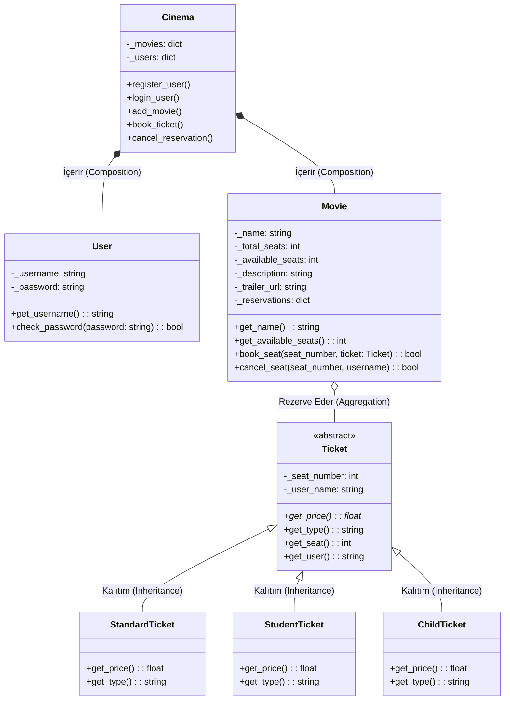

# UML Diyagramları

Aşağıdaki diyagramlar projenin çalışma prensibini ve nesneye dayalı mimarisini (OOP) açıklamaktadır. Diyagramlar Mermaid formatında oluşturulmuştur.

## 1. Class Diagram (Sınıf Diyagramı)

Bu diyagram sistemdeki sınıfları, özelliklerini (encapsulation) ve aralarındaki kalıtım (inheritance) ilişkilerini göstermektedir.



## 2. Use Case Diyagramı (Kullanım Durumu)

Sistemi kullanan aktörlerin gerçekleştirebileceği eylemleri gösterir.

```mermaid
usecaseDiagram
actor Kullanici as "Kayıtlı Kullanıcı"
actor Ziyaretci as "Ziyaretçi"

rectangle "Sinema Rezervasyon Sistemi" {
  Ziyaretci --> (Kayıt Ol)
  Ziyaretci --> (Giriş Yap)
  Ziyaretci --> (Filmleri ve Fragmanları Görüntüle)

  (Kayıt Ol) .> (Giriş Yap) : include
  
  Kullanici --> (Filmleri ve Fragmanları Görüntüle)
  Kullanici --> (Bilet Rezerve Et)
  Kullanici --> (Rezervasyon İptal Et)

  (Bilet Rezerve Et) .> (Giriş Yap) : include
}
```
